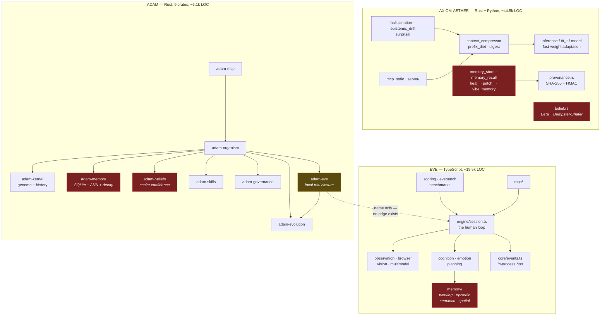
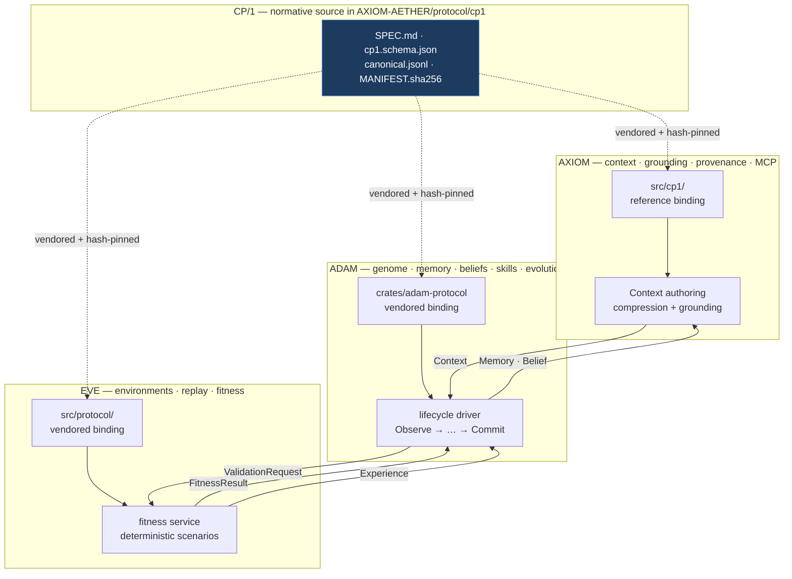

# The unified cognitive architecture

AXIOM-AETHER, EVE and ADAM are one organism, not three projects. This document
is the architectural audit that established that view, the ownership map that
resolves it, and the gap register that the CP/1 work closes.

It is written to be read in order: what exists, what is wrong with it, who owns
what, and what changed.

---

## 1. Audit

Measured on the `main` of each repository at the time of the audit.

| Repository       | Language          | Size                     | Tests                | Build |
| ---------------- | ----------------- | ------------------------ | -------------------- | ----- |
| **AXIOM-AETHER** | Rust + Python     | ~44.5k Rust, ~23 Python files | integrated per-module | `cargo check --lib` clean |
| **EVE**          | TypeScript        | ~19.5k across 130 modules | 252 across 35 files  | `vitest run` green |
| **ADAM**         | Rust (9 crates)   | ~6.1k                    | 88                   | `cargo test --workspace` green |

All three are individually healthy. The problem was never quality within a
repository — it was that there was no *between*.

### 1.1 Module responsibilities

**ADAM** — nine crates in one workspace, cleanly layered, with `adam-organism`
as the composition root and `adam-mcp` as the only transport.

| Crate             | Responsibility | Depends on | Cohesion |
| ----------------- | -------------- | ---------- | -------- |
| `adam-kernel`     | Versioned, hash-linked genome history; diff; forward-only rollback | — | high |
| `adam-memory`     | SQLite store; embeddings, ANN index, decay, conflict resolution, relation graph | — | high |
| `adam-beliefs`    | Evidence-and-confidence belief registry with lifecycle | — | high |
| `adam-skills`     | Skill registry with staged promotion (discover → … → promoted) | — | high |
| `adam-evolution`  | Signal analysis → mutation proposals; proposal store | — | high |
| `adam-governance` | Acceptance rate limits, rollback and decision audit log | — | high |
| `adam-eve`        | Scored evolution proposals via trials (**see gap G-1**) | `adam-evolution` | high |
| `adam-organism`   | Composition root; the surface MCP wraps | all of the above | medium — it is large, but it is the only place mutation happens, which is a property worth the size |
| `adam-mcp`        | JSON-RPC transport, tool schemas, organism pool | `adam-organism` | high |

Coupling is acyclic and shallow: every crate but `adam-organism` and `adam-eve`
depends on nothing inside the workspace. That is a genuinely good structure.

**EVE** — 130 modules, flat under `src/`, organized by cognitive faculty.

| Cluster | Modules | Responsibility |
| ------- | ------- | -------------- |
| Perception | `observation/`, `browser/`, `vision/`, `multimodal/` | Reduce a rendered surface to what a human could perceive |
| Cognition | `cognition/`, `emotion/`, `memory/`, `planning/` | Decide, predict, appraise, remember |
| Measurement | `scoring/`, `evebench/`, `benchmarks/`, `calibration/`, `regression/` | Turn sessions into numbers, and validate those numbers |
| Aggregation | `population/`, `twins/`, `study/`, `panel/`, `predict/`, `forecasting/` | Many operators → statistical claims |
| Output | `reporting/`, `research/`, `trends/`, `product/` | Render findings |
| Infrastructure | `core/`, `config/`, `engine/`, `mcp/`, `plugins/`, `cli/` | Bus, types, RNG, transport |

`core/random.ts` deserves specific note: the entire engine draws stochastic
behavior from one seeded `Rng`, never `Math.random`. Deterministic replay was
therefore already true in EVE before this work — it just had no consumer outside
EVE.

**AXIOM-AETHER** — two Rust workspaces plus a Python package. The largest and
least even of the three.

| Cluster | Modules | Responsibility |
| ------- | ------- | -------------- |
| Inference | `inference`, `model`, `ttt_block`, `ttt_mlp`, `test_time_adapter`, `kernel` | Test-time-training inference |
| Context | `context_compressor`, `responses_compressor`, `prefix_diet`, `digest`, `encoder` | Compression and context engineering |
| Epistemics | `hallucination`, `epistemic_drift`, `belief`, `surprisal` | Grounding and validation |
| Provenance | `provenance`, `cvm_store`, `cost_ledger`, `session_recorder` | Tamper-evident custody |
| Memory | `memory_store`, `memory_recall`, `memory_pool`, `heal_memory`, `patch_memory`, `vibe_memory` | Six overlapping stores (**gap G-2**) |
| Repair | `self_heal`, `fault_locate`, `rebase`, `skeleton`, `solve` | Autonomous program repair |
| Transport | `mcp_stdio`, `server/`, `*_forwarder`, `backend_router` | MCP and OpenAI/Anthropic-compatible surfaces |
| Mesh | `axiom_mesh_rs/{axiom_core,axiom_prime,axiom_mcp}` | Distributed routing |

### 1.2 The architecture graph, as found



Red: the same concept implemented independently in more than one place.
Amber: a component named for an integration that does not exist.

The critical observation is the dotted line. It is the only edge between any two
repositories, and it is not real.

---

## 2. Gap register

Every gap found, with the evidence that established it.

### G-1 — The EVE integration was a name, not an edge  *(severity: critical)*

`ADAM/crates/adam-eve` is documented as "EVE integration" and its evaluator as
`EVE ("Evaluate Via Experiment")`. It scores a mutation by calling a
caller-supplied Rust closure `TrialFn = dyn Fn(&EvolutionProposal) -> TrialOutcome`
some fixed number of times and averaging the pass rate.

It shares nothing with the EVE repository. A search across all three
repositories for cross-references returns two hits, both in EVE design documents
using "adam" as a common noun. There is no client, no schema, no transport, no
dependency.

The consequence is precise: `Organism::require_eve_approval` gates every genome
amendment beyond `preferences.*` on an `EvaluationResult` whose
`recommendation == Approve`. Whoever supplies the `TrialFn` decides that. The
gate is real, its evidence was not.

**The developmental lifecycle's "Validate inside EVE" step had no implementation.**

### G-2 — Duplicated memory implementations  *(severity: high)*

Three unrelated designs, plus four partial stores inside AXIOM alone:

| Where | Design | Unit |
| ----- | ------ | ---- |
| `ADAM/adam-memory` | SQLite, embeddings, ANN, decay, conflict graph | `MemoryRecord { kind, content, embedding, confidence, provenance, decay }` |
| `EVE/src/memory` | Four human subsystems: working, episodic, semantic, spatial | `Episode`, `LearnedFact`, `ScreenNode` |
| `AXIOM/memory_store` | Append-only JSONL per scope | `MemoryRecord { scope, kind, body, embedding, drift_at_ingest }` |
| `AXIOM/heal_memory`, `patch_memory`, `vibe_memory`, `memory_recall` | Four more, repair-specific | various |

Both ADAM and AXIOM export a type literally named `MemoryRecord`, with different
fields and incompatible `MemoryKind` enums (`episodic|semantic|procedural|self_knowledge`
versus `decision|code|conversation|fix`).

These are not accidental duplicates — they model genuinely different things. The
gap is that nothing said which one "memory" means.

### G-3 — Overlapping belief systems  *(severity: high)*

`ADAM/adam-beliefs` models a belief as a statement with scalar confidence,
evidence origin and a lifecycle. `AXIOM/belief.rs` models one as `Beta(α, β)`
with Dempster–Shafer combination and conflict detection.

AXIOM's is strictly more expressive: it distinguishes "succeeded 1 of 1" from
"succeeded 50 of 100", which a scalar collapses. ADAM's carries provenance and
lifecycle, which AXIOM's does not. Neither is wrong; both are called `Belief`.

### G-4 — No shared event system  *(severity: high)*

EVE has a typed in-process `EventBus` with session-scoped events
(`loop:perceive`, `finding`, `emotion:update`). It is well built and entirely
internal — events never leave the process, and no other repository can subscribe.

ADAM and AXIOM have no event system at all. ADAM's governance audit log is the
closest thing, and it records only acceptances, rejections and rollbacks.

Nothing observable connects the three.

### G-5 — Inconsistent terminology  *(severity: medium, and the root of G-2/G-3)*

The same word means different things across repository boundaries:

| Word | ADAM | EVE | AXIOM |
| ---- | ---- | --- | ----- |
| memory | durable provenanced record | human memory subsystem | JSONL scope store |
| belief | statement + scalar confidence | — | Beta distribution |
| fitness | trial pass rate | composite UX score 0–100 | — |
| evaluation | proposal scoring | session scoring + panel review | drift/grounding judgment |
| provenance | `{origin, evidence}` | — | SHA-256 + HMAC export |
| context | — | — | compressed model input |

### G-6 — Incompatible numeric conventions  *(severity: medium)*

ADAM uses `f32` for confidence, fitness and decay. EVE uses TypeScript `number`
(IEEE-754 double) for scores in `0..1` and `0..100` inconsistently. AXIOM uses
`f32` for beliefs and `f64` elsewhere.

A protocol carrying floats across these has no reproducible canonical rendering,
which makes hash-stable provenance impossible. This gap had to be closed before
any of the others could be.

### G-7 — Missing evolution interface  *(severity: high)*

ADAM can propose and apply mutations. Nothing outside ADAM can propose one,
inspect the proposal queue, or supply evidence for or against one. Evolution is
sealed inside the component that performs it — so no external measurement can
ever reach it, which is G-1 stated from the other side.

### G-8 — Missing lifecycle management  *(severity: high)*

Every stage of the developmental lifecycle exists as a method somewhere. No
component executes the sequence. `Organism::reflect` returns a summary but
consolidates nothing; there is no `observe`; consolidation from repeated
episodes into semantic memory is described in `adam-memory`'s module docs and is
not driven by anything.

The organism had organs and no metabolism.

### G-9 — Missing provenance across boundaries  *(severity: high)*

ADAM's `Provenance { origin, evidence }` is free-text and does not chain: there
is no way to walk from a belief to the memories that formed it to the
experiences those came from. AXIOM's `SignedExport` chains cryptographically but
covers only swarm immunity payloads. EVE emits no provenance at all.

An organism claiming reproducible evolution needs one chain across all three.

### G-10 — Missing identity continuity guarantee  *(severity: medium)*

ADAM's `Identity { name, description }` lives inside the genome and is versioned
with it. There is no lineage identifier stable across genome versions, so "the
same organism" is not expressible — and the final objective, *identity survives
model replacement*, has no representation to survive in.

### G-11 — Missing capability abstraction  *(severity: medium)*

`Genome.capabilities` is `Vec<String>`. Nothing says what a capability means,
what provides it, or what it requires. A capability cannot be re-provided by a
different backend, which is exactly what "survive model replacement" demands.

### G-12 — Benchmarks measure one repository each  *(severity: low)*

EVE has `evebench` (multi-dimensional, construct-validated against three
reference apps of known quality). ADAM has Criterion benches on genome and
memory retrieval. AXIOM has `bench/`. None measures the organism.

---

## 3. The unified architecture

### 3.1 Ownership

Every concept has exactly one owner. Ownership means **exclusive authorship**:
only the owner may mint a document of that type. Everyone may read.

| Concept | Owner | Why this owner and not another |
| ------- | ----- | ------------------------------ |
| Context engineering, compression | **AXIOM** | Owns the inference path; compression is meaningless separated from the model consuming it |
| Grounding, epistemic validation | **AXIOM** | Grounding is a property of a context against evidence, and AXIOM builds contexts |
| Fast-weight adaptation | **AXIOM** | The TTT stack is here and nowhere else |
| Provenance, MCP infrastructure | **AXIOM** | Already has the only real crypto and the most complete MCP surface |
| Environments, simulations | **EVE** | Sole component that can drive a surface and perceive it |
| Deterministic replay | **EVE** | Sole component with a seeded RNG discipline covering all stochastic behavior |
| Evaluation, fitness measurement | **EVE** | Fitness must be measured by something that is not the thing being measured |
| Benchmark scenarios | **EVE** | `benchmarks/apps.ts` is a construct-validated instrument; recreating it elsewhere would fork the yardstick |
| Genome, identity | **ADAM** | Owns the hash-linked version history that makes identity continuous |
| Beliefs, long-term memory | **ADAM** | Owns the durable, provenanced, decaying store |
| Skills, evolution, reflection, self-model | **ADAM** | Owns the only place mutation is applied |

Two ownership decisions were genuinely ambiguous and were resolved by
redesigning rather than splitting:

- **Beliefs (G-3).** AXIOM's Beta beliefs are more expressive than ADAM's
  scalar ones, which argues for AXIOM owning them. But belief *lifecycle*
  (formed, weakened, retracted, superseded) and belief *provenance* are what the
  organism needs, and those are ADAM's. Resolution: **ADAM owns `Belief`.** The
  canonical type carries `uncertainty_bp` alongside `confidence_bp` precisely so
  AXIOM's distribution projects onto it without losing the distinction a scalar
  would collapse. AXIOM keeps `BetaBelief` as an internal representation and
  converts at the boundary.

- **Fitness (G-1).** ADAM computed it, and ADAM consumes it. But a component
  scoring its own proposed changes is not measurement, it is assertion — the
  precise failure `adam-eve` embodied. Resolution: **EVE owns `FitnessResult`.**
  ADAM may read it and must not mint it, which is why `provenance.authored_by`
  is mandatory and checked.

### 3.2 The protocol layer

Repositories communicate through **CP/1**, specified normatively in
[`protocol/cp1/SPEC.md`](../protocol/cp1/SPEC.md). Twelve canonical types, a
closed set of fourteen events, mandatory chained provenance, and a canonical
byte encoding with no floating point on the wire (closing G-6).

Each repository vendors a hand-written binding plus the golden fixture corpus,
and runs the shared conformance suite against it. There is no build-time
dependency in any direction — which is what makes the arrangement survivable
across three languages and three release cadences. `MANIFEST.sha256` plus the
per-repository conformance tests turn "keep three bindings in sync" from an
informal obligation into a CI failure.

### 3.3 The architecture, as designed



Every inter-repository edge is a CP/1 document over a transport, never a symbol
reference.

### 3.4 The developmental lifecycle

```
Observe → Experience → Reflect → Consolidate memory → Update beliefs
   → Generate mutations → Validate inside EVE → Measure fitness
   → Commit genome → continue operating
```

No shortcuts, and one enforced in code: a mutation touching the genome beyond
`preferences.*` cannot be accepted without a `FitnessResult` that recommends
approval, was authored by EVE, and chains by provenance to a real simulation
run. Preference amendments remain ungated because they are low-stakes and
reversible; everything else is identity.

---

## 4. Gap disposition

| Gap  | Disposition |
| ---- | ----------- |
| G-1  | Closed. `adam-eve` becomes a CP/1 client; the scoring policy is kept, the fabricated evidence source is replaced by EVE's real measurement |
| G-2  | Resolved by ownership, not merger. ADAM owns `Memory`; EVE's and AXIOM's stores remain internal representations that project onto it at the boundary |
| G-3  | Resolved by ownership. ADAM owns `Belief`; `uncertainty_bp` preserves what AXIOM's Beta model knows |
| G-4  | Closed. CP/1 events, closed set of fourteen, with correlation and causation ids |
| G-5  | Closed. The canonical type table is the glossary |
| G-6  | Closed. Basis points; floats are rejected at the encoder, not tolerated |
| G-7  | Closed. `ValidationRequest`/`FitnessResult` make evolution externally addressable |
| G-8  | Closed. The lifecycle driver executes the sequence |
| G-9  | Closed. Mandatory `Provenance` with `derived_from`, hashed over evidence |
| G-10 | Closed. `Identity.lineage_id`, stable across every genome version and model |
| G-11 | Closed. `Capability` names its provider and requirements |
| G-12 | Open, deliberately. Cross-organism benchmarking needs the lifecycle to have run against real workloads first; measuring it before then would produce a number with no referent. Tracked, not shipped |

---

## 5. What a living cognitive organism requires that current systems lack

The design questions that drove the decisions above, recorded so later changes
can be judged against them rather than against taste.

**Continuity of self under substrate replacement.** A model is an organ, not the
organism. `Identity.lineage_id` is stable across every genome version and every
model; nothing model-specific may appear in `Identity` at all. Swapping the
inference backend changes a `Capability`'s provider, not who the organism is.

**Evidence that is not self-reported.** The single most consequential finding of
this audit was a component scoring its own proposals and calling the result
measurement. Fitness is now counterfactual — baseline and candidate over the
same scenarios at the same seed — and authored by a component with no stake in
the outcome.

**Reversibility without amnesia.** ADAM's genome history was already
append-only, with rollback implemented as a forward commit of prior content.
That property is preserved and extended: nothing in CP/1 deletes, and
`derived_from` means the reasoning behind a retracted belief remains walkable
after the retraction.

**Knowing why it believes something.** `Context` is separate from `Memory` and
`Belief` on purpose. What the organism knows is durable and owned by ADAM; what
it is attending to right now is derived, ephemeral, and owned by AXIOM. A system
that conflates them cannot explain its own output, because the explanation *is*
the context.

**Bounded, auditable change.** Governance rate-limits acceptances and logs every
decision. Combined with mandatory provenance and deterministic validation, the
organism's evolution is reproducible: given the same genome, the same signals
and the same seed, it evolves the same way.
